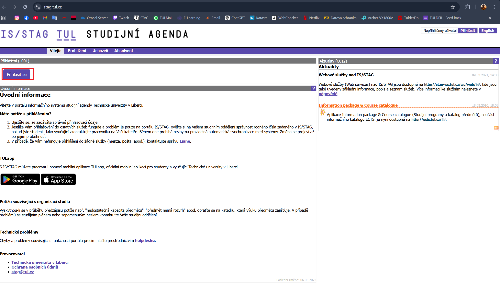
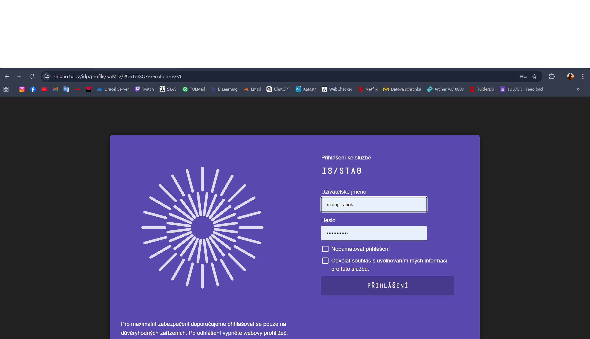
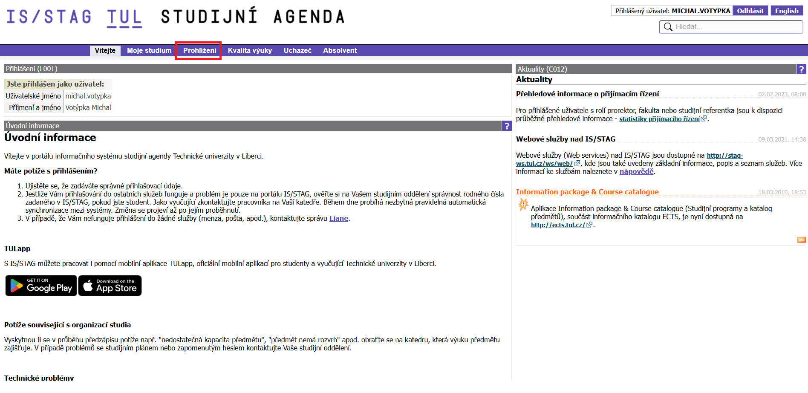
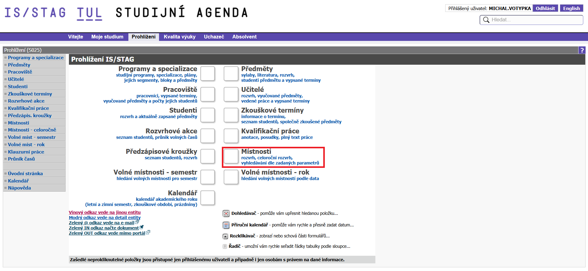
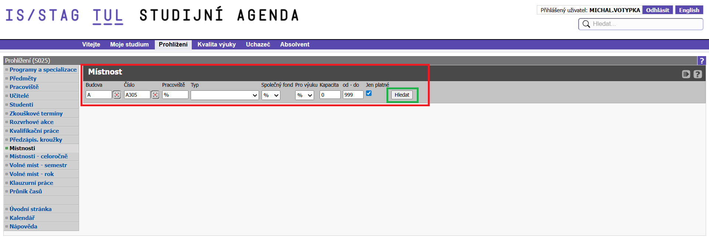
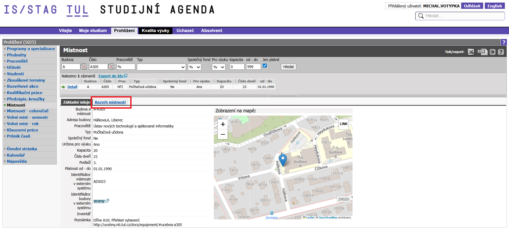

# 🏫 Jak zobrazit místnost a její rozvrh v IS/STAG (TUL)

Tento návod popisuje postup, jak vyhledat místnost a zobrazit její detail a rozvrh v systému IS/STAG Technické univerzity v Liberci.

---

## 1️⃣ Otevření systému STAG

Přejdi na oficiální stránku:

👉 https://stag.tul.cz/

Klikni na tlačítko **„Přihlásit se“**.

---

## 2️⃣ Přihlášení

Vyplň své přihlašovací údaje:

- Uživatelské jméno  
- Heslo  

Klikni na tlačítko **„PŘIHLÁŠENÍ“**.

---

## 3️⃣ Sekce „Prohlížení“

Po přihlášení klikni v horním menu na:

➡ **Prohlížení**

---

## 4️⃣ Místnosti

V přehledu klikni na:

➡ **Místnosti**

---

## 5️⃣ Vyhledání místnosti

V horní části stránky je vyhledávací formulář.

⚠️ **Je nutné minimálně vyplnit:**
- **Budova**
- **Číslo místnosti**

Bez těchto údajů nebude možné místnost správně vyhledat.

Volitelně můžeš vyplnit i další parametry:
- Pracoviště  
- Typ  
- Kapacitu  
- a další filtry  

Poté klikni na tlačítko **„Hledat“**.

Po zobrazení výsledků klikni na konkrétní místnost (např. „Detail“).

---

## 6️⃣ Detail místnosti

Zobrazí se detail místnosti, kde uvidíš:

- Budovu  
- Číslo místnosti  
- Adresu  
- Typ místnosti  
- Kapacitu  
- Informaci, zda je určena pro výuku  
- Mapu umístění  

---

## 7️⃣ Rozvrh místnosti

Pro zobrazení rozvrhu klikni na záložku:

➡ **Rozvrh místnosti**

Zde uvidíš přehled všech akcí (výuky, zkoušek apod.), které se v dané místnosti konají.

---

## ✅ Hotovo

Tímto způsobem můžeš zjistit informace o konkrétní místnosti a zobrazit její aktuální rozvrh.