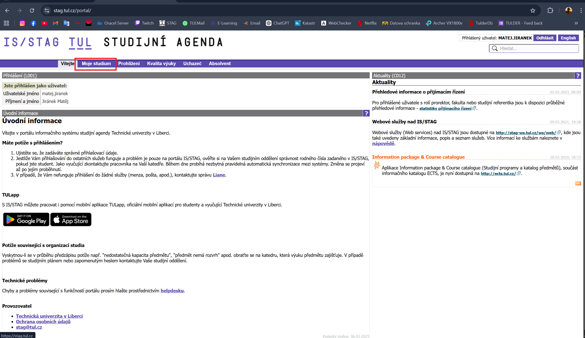
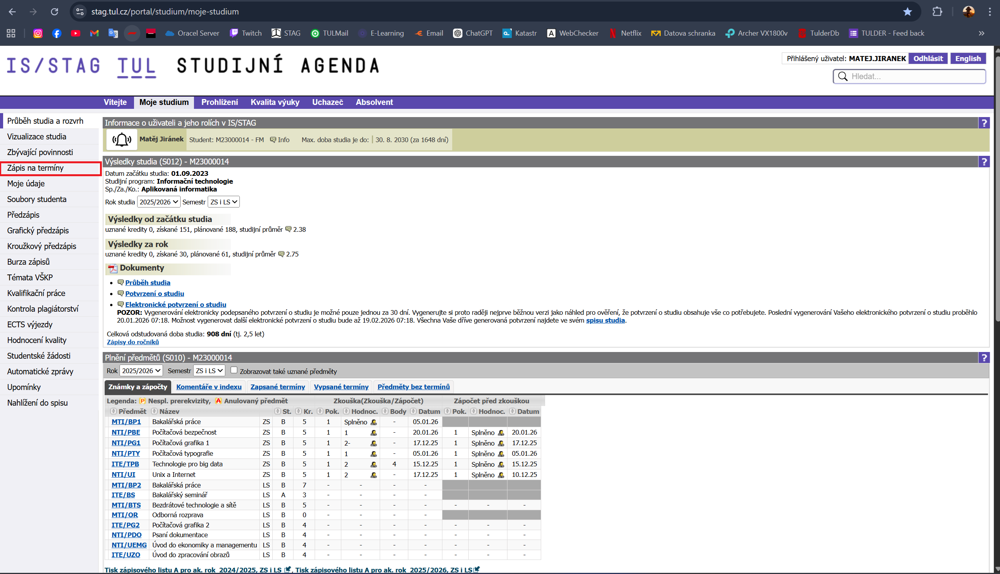
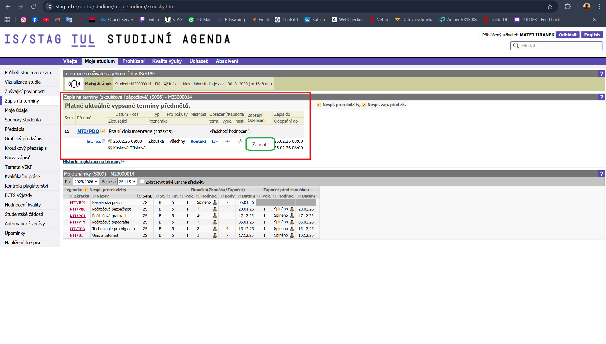

# 📚 Přihlášení na zkoušku v IS/STAG (TUL)

Tento návod popisuje postup, jak se přihlásit na zkoušku v systému **IS/STAG Technické univerzity v Liberci**.

---

## 1️⃣ Otevření systému STAG

Přejdi na oficiální stránku:

👉 https://stag.tul.cz/

Klikni na tlačítko **„Přihlásit se“**.

---

## 2️⃣ Přihlášení

Vyplň své přihlašovací údaje:

- Uživatelské jméno
- Heslo

Klikni na tlačítko **„PŘIHLÁŠENÍ“**.

---

## 3️⃣ Otevření sekce „Moje studium“

Po přihlášení klikni v horním menu na:

➡ **Moje studium**

---

## 4️⃣ Záložka „Zápis na termíny“

V levém menu klikni na:

➡ **Zápis na termíny**

---

## 5️⃣ Výběr předmětu a termínu

Vyber:

- Předmět
- Datum a čas vypsaného termínu (červeně označeno)

Klikni na tlačítko **„Zapsat“** (zeleně označeno).

---

## ✅ Hotovo

Úspěšně jste se přihlásili na zkoušku.
