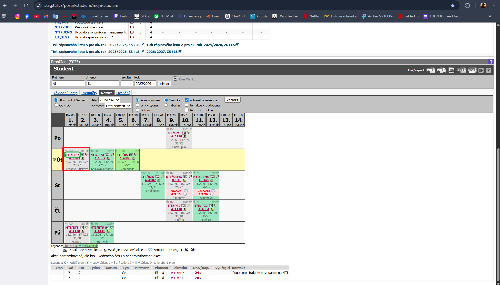
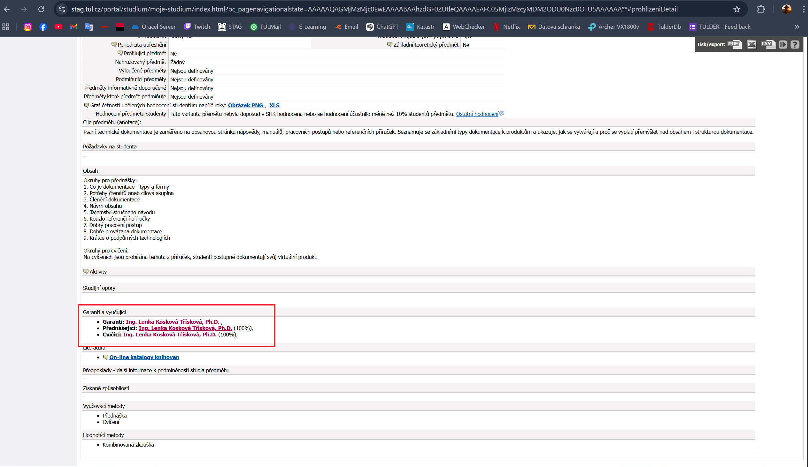

# 👨‍🏫 Jak zjistit, kdo učí předmět v IS/STAG (TUL)

Tento návod popisuje postup, jak zjistit vyučujícího konkrétního předmětu v systému IS/STAG Technické univerzity v Liberci.

---

## 1️⃣ Otevření systému STAG

Přejdi na oficiální stránku:

👉 https://stag.tul.cz/

Klikni na tlačítko **„Přihlásit se“** a přihlas se svými údaji.

---

## 2️⃣ Sekce „Moje studium“

Po přihlášení klikni v horním menu na:

➡ **Moje studium**

---

## 3️⃣ Průběh studia

V levém menu klikni na:

➡ **Průběh studia**

---

## 4️⃣ Rozvrh

Sjeď dolů na část **Rozvrh**.

V rozvrhu:

- Najdi předmět, který chceš zjistit (červený obdélník)
- Klikni na název předmětu (zelený obdélník)

---

## 5️⃣ Vyučující

Na stránce předmětu sjeď úplně dolů.

V dolní části stránky uvidíš vyučující daného předmětu (červený obdélník).

---

## ✅ Hotovo

Tímto způsobem zjistíš, kdo daný předmět vyučuje.